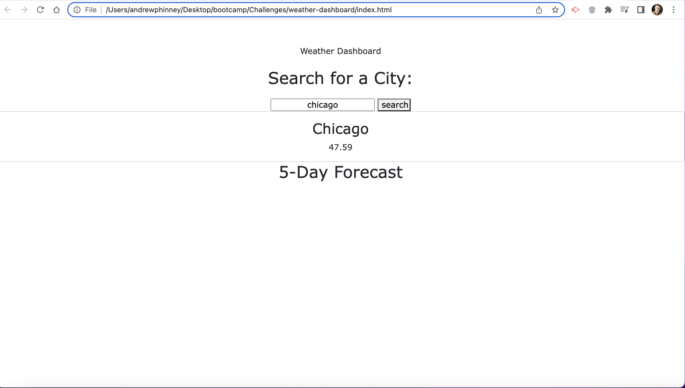

# weather-dashboard

## Description
I created this project with the intention of being able to check the wcurrent and future weather for the city of my choice. It solves the problem of unpreparedness and planning when it come to what to wear and what to do based on the weather. I learned that I still have a lot to learn when it comes to using APIs and Bootstrap.

## Installation
To access the web document navigate to the following link: https://aphinney0516.github.io/weather-dashboard/ and type in the desired city in the text box then click the "search" button.

## Usage
Use this app when you want to check the current weather, or see what the weather will be for the next 5 days for a specific city. Simply type in the desired city name in the text box and hit search as depicted in the screen shot below.

## Credits
I worked through a large portion of this app with my tutuor Corey Yates.
